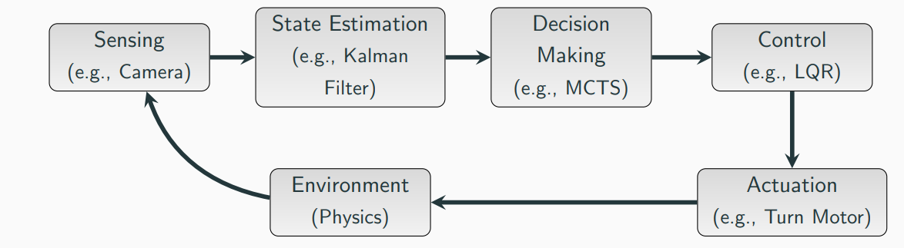
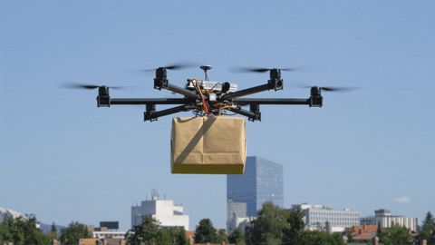
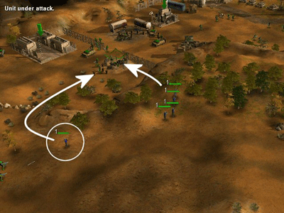

# Motion Planning

*Author: Zaynap Ahmad*  
*Reviewed by: KG*

## Introduction

#### Robotics Piple line

  

**Motion Planning is a part of decision making: How to reach the goal, given the state of the robot and environment, without collisions.**

Note : Modern robotic systems do not strictly separate parts of the classic robotics pipeline.[16]

---

  

Motion planning is a fundamental aspect of robotics and autonomous systems. It involves determining a sequence of movements or actions that a robot should take to achieve a specific goal, such as moving from one location to another while avoiding obstacles.

Imagine you have a toy car that you want to drive from one side of your living room to the other. But there are obstacles on the floor, like a chair and a table. **Motion planning** for the toy car means figuring out how to steer it around the obstacles so it can reach the destination without crashing into anything. You might plan a path that goes around the chair and between the table legs to get there safely.

In simple terms, motion planning is like making a step-by-step guide for your toy car (or any robot) to follow so it can get where you want it to go without running into problems along the way.

Motion planning is the process that guides a robot from the moment it begins moving until it successfully reaches its goal [1].

  

## Applications of Motion Planning

Motion planning has a wide range of applications in various fields:

### Autonomous Vehicles

Motion planning is crucial for navigating cars through complex traffic situations, including dealing with dynamic obstacles like other vehicles, pedestrians, and traffic signals [3].

  

### Industrial Robots

In manufacturing and assembly lines, industrial robots use motion planning to perform tasks such as welding, painting, and assembling parts with precision and efficiency [2].

<!-- 

  

 -->

  

### Drones

Drones use motion planning for aerial navigation, allowing them to fly through various environments, avoid obstacles, and complete tasks like surveying or delivery.

  

> **motion planning has applications in other fields, such as animating digital characters, video game, architectural design, robotic surgery, and the study of biological molecules.**

##### motion planning in games

  

##### motion planning in Molecular Simulations

  

## History of Motion Planning

1. Claude Shannon, who introduced the idea of “piano mover’s problem” (1950s)
2. 1968: Development of A* for Shakey (Robot at SRI)
3. 1979: Complexity of motion planning (PSPACE)
4. 1984: Complexity of multi-robot motion planning (PSPACE)
5. 1996–: Sampling-based Planning
6. 2008: Initial version of the Search-based Planning Library (SBPL)
7. 2012: Initial version of the Open Motion Planning Library (OMPL)  ---- > have brief on this
8. 2011: Rediscovery of optimization-based motion planning
9. Last decade: hybrid approaches; combination with machine learning

## Motion Planning vs. Path Planning

**Path planning** is essentially a preliminary step within the broader context of motion planning. While path planning identifies a valid route from a start point to a goal, motion planning takes this a step further by determining how the robot can physically execute that route, factoring in its dynamics and the environment's changing nature.

| Aspect                   | Path Planning                                   | Motion Planning                                                                      |
| ------------------------ | ----------------------------------------------- | ------------------------------------------------------------------------------------ |
| **Focus**          | Finding a valid route                           | Determining movements and trajectories                                               |
| **Environment**    | Typically static                                | Often dynamic                                                                        |
| **Representation** | Discrete (grid/graph)                           | Continuous (trajectories)                                                            |
| **Considerations** | Static map                                      | Robot kinematics, dynamics, and constraints                                          |
| **Examples**       | Calculating the route the robot should navigate | Navigating through the route, avoiding dynamic obstacles, making real-time decisions |

  

## Motion Planning Process

The overall motion planning process usually involves the following steps:

1. **Perception**: Sensing the environment to gather information about obstacles, terrain, and other relevant features.
2. **Map Representation**: Creating a map of the environment, including static and dynamic obstacles.
3. **Global Path Planning**: Computing a high-level path from the start to the destination, typically using algorithms that optimize a cost function based on the environment’s features.
4. **Local Path Planning**: Adjusting the robot’s trajectory in real-time to navigate around dynamic obstacles or handle unexpected changes in the environment.
5. **Execution**: Executing the planned path using the robot’s actuators.

## Basic Concepts in Motion Planning

### Inputs and Outputs of Motion Planning

To plan its motion, a robot requires certain inputs and produces specific outputs.

#### Inputs

1. **Robot Specifications**

   - **Geometry**: The shape and size of the robot, affecting how it can move in the environment.

     - > Finally, geometry refers to Rahal’s shape and size, which helps us determine how much space it needs to maneuver. By understanding its geometry, we can ensure that the planned paths avoid tight spots or obstacles that might block its way.
       >
   - **Kinematics**: How the robot moves without considering forces (e.g., speed, turning radius).

     - > Understanding **Rahal’s kinematics** is crucial, as it tells us how fast it can go and how quickly it can turn; this information helps us plan smoother routes that match its movement abilities.
       >
   - **Dynamics**: Forces that affect movement, such as acceleration, deceleration, and load carrying.

     - > We also need to consider dynamics, which involves the forces that affect Rahal’s movement, such as what happens when it speeds up, slows down, or carries a heavy load. Knowing these dynamics allows us to plan for safe stopping distances and smooth acceleration, which prevents accidents during navigation.
       >
   - > Understanding these specifications—**geometry**, **kinematics**, and **dynamics**—helps us create an effective navigation plan. Different types of robots require different algorithms based on their unique capabilities, so knowing how Rahal operates is essential for successful navigation.
     >

    

      
    

      

      
    

  

    

      
    

    

      
    

  

1. **Environment Map**

   - **Obstacles**: Locations of fixed and dynamic obstacles in the environment.

     - > *Obstacles*: Identifying fixed and dynamic obstacles, such as walls, furniture, or moving people, is crucial. Knowing their locations allows *Rahal* to plan paths that avoid collisions, ensuring smooth navigation through complex spaces.
       >
   - **Boundaries**: Edges of the operational area, such as walls or restricted zones.

     - > **Boundaries**: Recognizing the edges of the operational area—like walls or restricted zones—helps to prevent **Rahal** from straying into unsafe or undesirable locations. Clear boundary definitions aid in maintaining a safe navigation envelope.
       >
   - **Terrain Features**: Characteristics like slopes, surfaces, and changes in elevation.

     - > **Terrain Features**: The characteristics of the terrain, such as slopes, surfaces (e.g., gravel, grass, or pavement), and changes in elevation, significantly impact **Rahal’s** movement. Understanding these features helps in planning routes that account for traction and stability, ensuring safe and efficient traversal.
       >
   - > **Map Representation**: Whether a 2D grid or a more complex 3D model, the environment map provides a comprehensive view of the operational space. This representation aids in real-time decision-making, enabling **Rahal** to adapt to changes in its surroundings.
     >
   - > By thoroughly understanding the **Environment Map**, we can develop effective navigation strategies that account for various obstacles and terrain characteristics, enhancing **Rahal’s** ability to operate safely and efficiently in diverse environments.
     >

  

2. **Initial State**

   - **Starting Position**: Where the robot is when it begins.

     - > **Starting Position** : This tells us exactly where **Rahal** is when it starts. For example, it might be in a specific spot in the room. Knowing this helps us figure out the best way to get to the goal.
       >
   - **Orientation**: The direction the robot is facing at the start.

     - > **Orientation** : This means which direction **Rahal** is facing when it begins. If it’s facing the wrong way, we need to plan for it to turn around before it can start moving toward the goal.
       >
   - **Current Status**: Information like speed and readiness to start the task.

     - > **Current Status** : This includes important information like how fast **Rahal** is moving (its speed) and whether it’s ready to go:
       >

       - **Velocity** (Speed) : If **Rahal** is already moving, knowing how fast it’s going helps us predict where it will be soon. If it’s not moving, we’ll plan for it to start moving.
       - > **Task Readiness** : We also need to check if **Rahal** is ready to begin its task. Is it charged up? Are there any problems that need fixing before it starts?.
         >
3. **Goal State**

   - **Exact Location**: The specific coordinates or position the robot needs to reach.
   - **Target Features**: Characteristics of the goal if the exact location is unknown.

  

#### Outputs

- **Path/Trajectory**: A detailed movement sequence considering dynamics and kinematics.
- **Control Commands**: Instructions for actuators to follow the path.
- **Obstacle Avoidance Strategy**: Real-time adjustments for dynamic obstacles.

### Basic Ingredients of Planning

#### State and Configuration Space (C-space)

- **State**: A snapshot of the robot's position, orientation, and condition at a given moment.

  - > Imagine **Rahal** as it moves through different rooms in a house. Each point in its journey—like being in the living room, next to a couch, or at a specific speed—defines a unique "state." Each state represents **Rahal’s** position, orientation, and condition at a given moment.
    >
- **Configuration Space**: A representation of all possible positions and orientations the robot can have.

  - > when compine all these together we get the **Configuration Space (C-space)**: C-space is a way of visualizing all the possible positions and orientations that Rahal can occupy in its environment. Just as each physical position (like being next to the couch) represents a unique state, each configuration in C-space corresponds to the robot's potential arrangements in the room.
    >
- > For example, if **Rahal** can rotate, move sideways, and go forward or backward, each of these movements creates a different configuration. The entire set of these configurations forms a multi-dimensional space where each point represents a possible arrangement of **Rahal**.
  >

  

#### Time

Time is critical in motion planning, affecting:

- > Time adds a critical layer to motion planning for **Rahal**. It’s not just about finding a path to a goal; it’s about reaching that goal within a specific time frame and being adaptable to the dynamic nature of its environment. when **Rahal** moving through a room when suddenly a person enters, creating a new obstacle. In this scenario, **Rahal** must quickly recalibrate its path to avoid a collision while still progressing toward its destination.
  >
- **Timing of Actions**: Ensuring movements are executed smoothly and efficiently.

  - > **Timing of Actions**: Each movement **Rahal** makes—whether it's accelerating, turning, or decelerating—must be meticulously timed. This ensures that it maneuvers smoothly and efficiently, without hesitation or delay.
    >
- **Real-Time Adaptability**: Adjusting plans quickly in response to dynamic changes.

  - > ** Real-Time Adaptability**: The environment around **Rahal** is not static; it can change at any moment. If an obstacle suddenly appears—like a pet or a piece of furniture being **shifted—Rahal** must instantly recalibrate its path. This requires sophisticated algorithms capable of rapid path computation to navigate around the new challenge effectively.
    >
  - 
- **Time Constraints**: Meeting deadlines or specific time frames.

  - > **Time Constraints**: **Rahal** may be tasked with specific time-sensitive operations, such as delivering a cup of coffee before it cools down. These deadlines add an extra layer of urgency, compelling **Rahal** to prioritize speed without sacrificing safety.
    >
- > **Note** : Time is the heartbeat of **Rahal's** planning process. It must seamlessly integrate the ability to adapt to real-time changes while meeting deadlines, ensuring it can navigate effectively and efficiently in a fluid environment.
  >

#### Actions

Movements or steps the robot takes, transforming its state and bringing it closer to the goal.

> Every action **Rahal** takes—whether moving forward, turning, or stopping—transforms its state and brings it closer to its goal.

- > These actions serve as the fundamental building blocks of **Rahal's** journey, requiring precision and accuracy to navigate effectively.
  >
- > Each movement is carefully calculated, ensuring that **Rahal** transitions smoothly from one state to another.
  >

#### Initial and Goal States

> Before the robot can start its journey, it needs to know two important things: where it currently is (initial state) and where it wants to go (goal state).

- > For example, **Rahal** starts in the kitchen (initial state) and needs to navigate to the living room (goal state). It must plan its route carefully to avoid obstacles like furniture or pets along the way.
  >
- **Initial State**: The robot's starting position, orientation, and status.

  - > **Localization**: The initial state comes from localization, which helps **Rahal** determine its current position within the environment.
    >
- **Goal State**: The desired end position and any tasks to be completed.

  - > The goal state can be identified in two ways:
    >

    - > **Exact Position**: **Rahal** knows the exact coordinates of the goal, allowing it to plot a direct path.
      >
    - > **Feature-Based Knowledge**: **Rahal** may only recognize certain features of the goal area (like a specific color or shape), which means it must locate the exact position as it gets closer.
      >

#### Criterion: Feasibility and Optimality

> When planning the Robot's route, we must consider two essential criteria: feasibility and optimality.

  

- **Feasibility**: Can the robot reach the goal without collisions?

  - > **Feasibility**: This criterion checks if the Robot can reach its goal without running into obstacles. A feasible plan might not be the quickest route, but it guarantees that **Rahal** arrives safely at its destination. For instance, it may take a longer path around a table to avoid collisions.
    >
- **Optimality**: Is the path efficient in terms of distance, time, energy, etc.?

  - > **Optimality**: This criterion aims to find the most efficient route for **Rahal**.This could mean the shortest distance, the least energy consumed, or the minimum time taken. For example, one route may be longer but safer, while another is shorter but risky because it passes too close to obstacles.
    >

### Planning Algorithm, Planner, and Plan

#### Planning Algorithm

A set of computational procedures that generate a plan for the robot to follow, accounting for uncertainties, dynamic changes, and robot constraints.

> **A planning algorithm** is the fundamental tool that a robot uses to decide how to move and interact with its environment. In essence, a planning algorithm generates a plan.

#### Plan

The actual sequence of actions or movements the robot will execute to achieve its goal.

> a **plan**, which is a sequence of actions or movements that will achieve a particular goal, like navigating a robot from its current position to a target destination while avoiding obstacles.

#### Planner

The system or framework that implements the planning algorithm, integrating sensor inputs, robot constraints, and environmental data to generate and execute the plan.

> The term planner refers to the system or software that implements the planning algorithm, deciding the sequence of actions based on sensor data and environmental understanding.

## Robot and Environment

### How Robot Characteristics Affect Motion Planning

- **Geometry**: Affects how the robot navigates through spaces.
- **Degrees of Freedom (DoF)**: The number of independent movements the robot can make.
- **Actuators and Sensors**: Influence the robot's ability to perceive and interact with the environment.
- **Payload Capacity**: Limits on what the robot can carry.
- **Speed and Acceleration**: Affect how quickly the robot can move and react.
- **Energy Consumption**: Impacts how long the robot can operate before needing to recharge or refuel.

### How Environment Characteristics Affect Motion Planning

- **Finite vs. Infinite**: The size and boundaries of the environment.
- **Known or Unknown**: Whether the robot has prior knowledge of the environment.
- **Discrete vs. Continuous**: The nature of the environment's representation.
- **Dynamic vs. Static**: Whether the environment changes over time.
- **Terrain Variability**: Differences in surface types and elevations.
- **Lighting and Visibility**: Affect perception capabilities.
- **Environmental Obstacles**: Presence of fixed and moving obstacles.
- **Goal Position Coordinates Defined or Not**: Whether the exact goal location is known.

## Layers of Motion Planning

Motion planning can be divided into several layers, each handling different aspects of the planning process.

> Imagine our robot, **Rahal**, as it prepares to navigate from one end of a room to another, avoiding obstacles and ensuring smooth movement.

- > The journey begins with **Route Planning**, where **Rahal** establishes a general path to the destination, steering clear of known obstacles and providing a high-level route map.
  >
- > As **Rahal** moves, **Local Planning** steps in to handle any unexpected hurdles in real-time, helping it maneuver around newly encountered objects or moving people.
  >
- > Meanwhile, **Behavior Planning** guides **Rahal’s** actions and prioritizes tasks, such as stopping to avoid a collision or yielding to another robot crossing its path.
  >
- > Finally, **Trajectory Planning** refines **Rahal’s** movements, optimizing speed and turns to ensure smooth, efficient, and safe motion toward the goal.
  >

> Together, these layers transform Rahal’s journey from a rough plan to a responsive, fluid navigation process.

  

### Route or Path Planning

**Definition**: Establishes a general path from the starting point to the destination, avoiding known obstacles.

> **Route Planning**, also called Path Planning, is the essential first step in Rahal’s journey. This phase creates a general path from the starting point to the destination, ensuring that fixed obstacles like walls, furniture, or restricted areas are avoided. This high-level path serves as an initial route that guides Rahal through the environment.

  

**Considerations**:

- Is the environment static or dynamic?
- How is the environment mapped and modeled?
- Can the path be computed on-the-fly if necessary?

#### Levels of Path Planning

  

1. **Types of Path Planning**:

   - **Holonomic**: Robots that can move freely in any direction.

     

       
     

   - **Nonholonomic**: Robots with movement constraints (e.g., cars that cannot move sideways).

     

       
     

   - **Kinodynamic**: Considers both motion and dynamic constraints, ensuring paths respect velocity and acceleration limits.

     

       
     

> Why it matters: Understanding these categories helps determine how flexible or constrained your robot's movement should be.

  

2. **Path Planning Process**:

  

- **Environment Modeling**: Creating a representation of the environment.

  - > **Environment Modeling**: Construct a detailed representation of the robot's surroundings. This could be a simple map with known obstacles or a dynamic map that changes as the robot explores.
    >
- **Search for an Optimal/Feasible Path**: Using algorithms to find a suitable path.

  - > Search for an Optimal/Feasible Path: Using the modeled environment, algorithms work to find a path that meets your objectives, whether it's minimizing distance, saving energy, or maximizing safety.
    >

3. **Path Planning Strategy**:

   - **Off-line Planning**: Pre-computing the path before the mission begins.

     - > Off-line Planning: Pre-compute the path before the mission begins. This approach is useful in static and predictable environments, where the optimal path can be calculated once and reused.
       >

  

- **On-line Planning**: Generating or modifying the path in real-time.

  - > On-line Planning: Generate or modify the path in real time as Rahal encounters unexpected obstacles. This strategy is crucial in dynamic or unknown environments where the robot must adapt on the fly.
    >
- > If Rahal is navigating through a crowded area, on-line planning enables it to respond to moving obstacles, like pedestrians, in real time.
  >

  

4. **Algorithm Types**:

  

- **Deterministic Algorithms**: Such as A* or Dijkstra, effective for well-mapped environments.

  - > Deterministic Algorithms: These methods, like A* or Dijkstra, yield consistent results and are effective for well-mapped, structured environments. They guarantee an optimal solution but can be computationally expensive.
    >
- **Probabilistic Algorithms**: Such as RRT and PRM, handle large and complex spaces efficiently.

  - > Probabilistic Algorithms: These algorithms, such as RRT and PRM, introduce randomness to efficiently handle large and complex spaces. They are especially useful when the environment is partially unknown or when rapid exploration is needed.
    >

## Trajectory Planning

  

**Definition**:Trajectory planning is the process of converting a pre-computed path into a detailed time-parameterized trajectory that specifies the robot’s speed, acceleration, and position at every moment during its journey.

> **Trajectory Planning** goes beyond simply finding a collision-free path. It ensures that the movement is smooth, feasible under the robot's dynamic constraints, and comfortable. For example, consider a robotic arm that needs to pick up an object. It must control its speed and acceleration to avoid sudden jerks that could damage delicate parts or the object itself.

### Key Considerations in Trajectory Planning

- **Dynamic Feasibility**:
  > The trajectory must respect the robot’s kinematic and dynamic constraints (such as maximum acceleration and deceleration). This guarantees that the robot can physically execute the plan without causing instability or undue wear on its actuators.
  >

  

- **Smoothness and Continuity**:

  > Abrupt changes in motion are not only inefficient but may also be unsafe. The trajectory planning process optimizes for smooth transitions, ensuring that acceleration, jerk, and higher derivatives of position remain within acceptable limits.
  >
- **Time Parameterization**:

  > By introducing time as a key component, trajectory planning defines the exact timing for each segment of the path. This allows the robot to synchronize its movements with dynamic obstacles or time-critical events in its environment.
  >
- **Optimization**:

  > Often, trajectory planning involves optimization techniques that balance several objectives such as minimizing energy consumption, travel time, or mechanical wear, while still meeting safety constraints.
  >

**Example**:
Imagine a self-driving car planning its route on a busy street. After the global path planning provides a collision-free path, trajectory planning calculates the detailed velocity profile to ensure the car accelerates and decelerates smoothly while obeying speed limits and preparing for stops at intersections.

---

## Behavior Planning

  

**Definition**:Behavior planning is the higher-level decision-making layer that guides the robot on which actions or tasks to prioritize based on the current environmental context, mission objectives, and the state of the robot.

> **Behavior Planning** acts like the “brain” behind the robot’s movement. While trajectory and path planning focus on “how” to move, behavior planning answers the “what” and “when” questions. For instance, an autonomous delivery robot may need to decide whether to continue moving towards its destination, yield to another robot, or stop to pick up a dropped package.

### Key Considerations in Behavior Planning

- **Task Prioritization**:

  > The robot may have multiple objectives (e.g., reaching a destination, avoiding collisions, performing a task). Behavior planning determines which objective should take precedence based on the situation.
  >
- **Context Awareness**:

  > By integrating data from various sensors and communication systems, behavior planning enables the robot to adapt its strategy if conditions change. For example, if an unexpected obstacle appears, the robot might temporarily switch from a “cruise” behavior to an “avoidance” behavior.
  >
- **Decision-Making Under Uncertainty**:

  > The robot may have incomplete information about its surroundings. Behavior planning often employs probabilistic models and learning algorithms to make robust decisions even when not all environmental factors are known.
  >
- **Interaction with Other Agents**:

  > In environments where multiple robots or humans are present, behavior planning includes rules for negotiation, yielding, or collaborative actions. This is crucial in crowded or dynamic settings.
  >

**Example**:
Consider an autonomous delivery robot navigating an office environment. As it moves through the hallways, its behavior planning module continuously assesses its surroundings. If it detects a group of people blocking the hallway, it might decide to slow down, re-route, or even wait until the path is clear—all while coordinating with its trajectory planner to ensure smooth motion.

## Challenges in Motion Planning

### Computational Complexity

Balancing the need for accurate path planning with computational resources is a key challenge. More accurate paths often require more complex algorithms, which can increase computation time and resource usage.

### Real-Time Constraints

Handling real-time updates and decision-making is crucial, especially in environments where conditions change rapidly. The software must be capable of making quick adjustments to the planned path to ensure effective navigation.

### Dynamic Environments

Adapting to moving obstacles and changes in the environment adds complexity to motion planning. The system must continuously update and adjust the path as new obstacles appear or the environment changes, requiring robust and flexible algorithms.

---

## References

1. LaValle, Steven M. *Planning Algorithms*.
2. [ResearchGate - Excitation Trajectory Programmed in RobotStudio](https://www.researchgate.net/figure/Excitation-trajectory-programmed-in-RobotStudio_fig1_263202228)
3. [MathWorks - Highway Trajectory Planning Using Frenet Reference Path](https://www.mathworks.com/help/nav/ug/highway-trajectory-planning-using-frenet.html)
4. [Fab Academy - Path Planning](https://fab.cba.mit.edu/classes/865.21/topics/path_planning/robotic.html)
5. [ResearchGate - Classification of Path Planning Levels](https://www.researchgate.net/figure/Classification-of-path-planning-levels_fig5_282054384)
6. [PMC - Types of Motion Planners](https://www.ncbi.nlm.nih.gov/pmc/articles/PMC7826951/)
7. [IEEE Xplore - A Survey on Motion Planning and Control Techniques for Self-Driving Urban Vehicles](https://ieeexplore.ieee.org/document/8206458)
8. [IEEE Xplore - The RRT*-Smart: Rapid Convergence Implementation of RRT*](https://ieeexplore.ieee.org/document/5354805)
9. [Schmerling, E., &amp; Pavone, M. (2019). Energy-Optimal Kinodynamic Planning for Vehicle Navigation](https://stanfordasl.github.io/wp-content/papercite-data/pdf/Schmerling.Pavone.EOR19.pdf)
10. [Medium - Types of Motion Planners at a Glance](https://medium.com/@junbs95/types-of-motion-planners-at-a-glance-617fdb07a762)
11. https://www.researchgate.net/publication/362577778_Mobile_robot_path_planning_using_a_QAPF_learning_algorithm_for_known_and_unknown_environments
12. https://www.geeksforgeeks.org/difference-between-deterministic-and-non-deterministic-algorithms/
13. https://link.springer.com/article/10.1007/s11370-022-00429-3
14. https://darko-project.eu/publications/2023-pubs/s%E2%88%97-on-safe-and-time-efficient-robot-motion-planning/
15. https://journals.plos.org/plosone/article?id=10.1371/journal.pone.0273640#sec001
16. [Wolfgang H¨onig (TU Berlin) and Andreas Orthey (Realtime Robotics) April 17, 2024](https://imrclab.github.io/teaching/motion-planning)
17. [PDF - motion planning for simulating molucules](https://homepages.laas.fr/nic/Papers/12CSR_AlBluwi.pdf)
